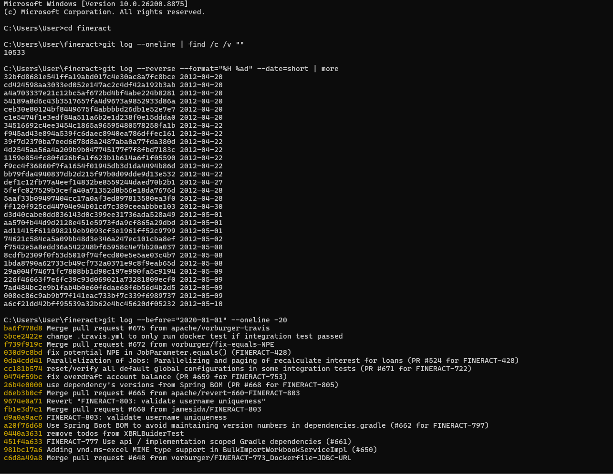
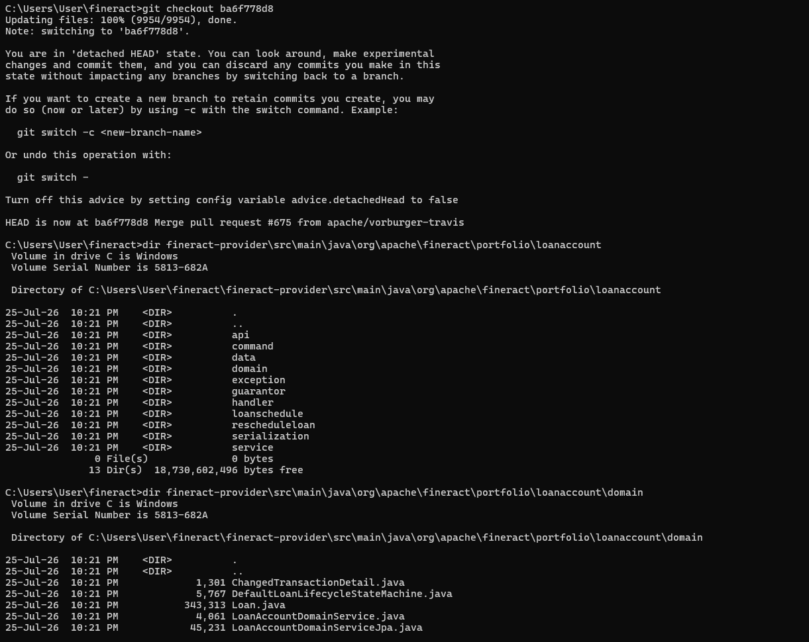
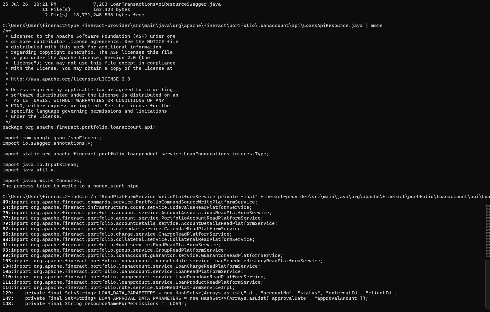
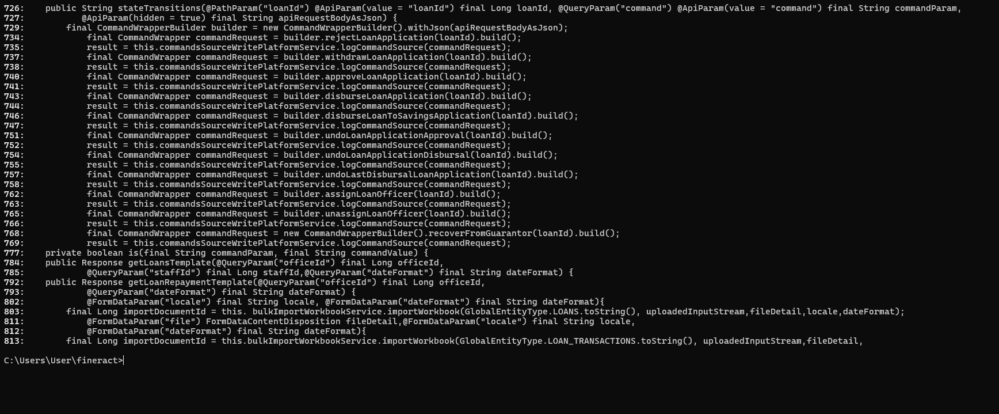

# Software Structure Analysis: LLM vs Human Code Structure in Core Banking Systems

[](https://www.oracle.com/java/)
[](https://spring.io/projects/spring-boot)
[](https://github.com/apache/fineract)

---

## Student & Course Metadata

| Field | Details |
| :--- | :--- |
| **Course Code & Name** | CSE 423: Software Engineering Structure Analysis |
| **Student Name** | Yousuf Abdullah Nirob |
| **Student Email** | `yousufabdullahn@gmail.com` |
| **Repository Name** | `llm-vs-human-code-structure` |
| **GitHub Repository** | [yousufabdullahnirob/llm-vs-human-code-structure](https://github.com/yousufabdullahnirob/llm-vs-human-code-structure) |
| **Submission Date** | July 30, 2026 |

---

## # Selected GitHub Projects

This assignment compares a pre-LLM production human enterprise system against an LLM-reconstructed system. Each project is kept strictly organized in its own separate directory:

### 1. Human Reference Project: Apache Fineract
- **Official GitHub URL:** [https://github.com/apache/fineract](https://github.com/apache/fineract)
- **Pre-LLM Snapshot Commit:** `ba6f778d8c39e248b6c43bf0848039ed678fa45d` (Short: `ba6f778d8`, Date: 2019-12-18)
- **Local Directory:** [fineract/](file:///e:/cse423/fineract/)
- **Technology Stack:** Java 17, Spring Boot, Spring Data JPA, Gradle Multi-Module Engine
- **Purpose & Role:** Serves as the human baseline benchmark for enterprise loan management architecture (>250,000 LOC, Apache Top-Level Project).
- **Detailed File Descriptions:** See [selected-files.md](file:///e:/cse423/selected-files.md#1-human-reference-project-apache-fineract)

### 2. LLM-Reconstructed Project: Reconstructed Core Banking System
- **Official Repository Location:** [llm-generated/](file:///e:/cse423/llm-generated/)
- **Technology Stack:** Java 17, Spring Boot 3.2.0, Spring Data JPA, H2 Database, Maven
- **Purpose & Role:** Generated across 3 prompt iterations to measure Layer Preservation (CQRS, DTOs) and Design Pattern Preservation (Strategy, Command, State).
- **Detailed File Descriptions:** See [selected-files.md](file:///e:/cse423/selected-files.md#2-llm-generated-project-reconstructed-banking-system)

---

## Team Comparative Analysis

This repository includes a comprehensive academic research comparison evaluating **MY PROJECT** (Apache Fineract $\rightarrow$ LLM reconstruction) against **MY TEAMMATE'S PROJECT** (OpenMetadata $\rightarrow$ Teammate's LLM reconstruction):
- **Full Comparative Report:** [Team Comparative Analysis](team-comparative-analysis.md)

This comparative report investigates the core research question: *"Why did two students using LLMs for the same type of software-structure analysis produce structurally distinct reconstructed systems?"* It covers empirical inventory audits, original source architecture comparison, prompt evolution analysis, 4-system architecture comparison, SOLID and code smell evaluations, metric consolidation, and causal chain analysis.

---

## # Repository Organization & Recommended Reading Order

```
e:\cse423\
├── README.md                             # Project landing page & navigation guide
├── team-comparative-analysis.md          # Comprehensive academic report comparing My vs Teammate projects
├── selected-files.md                     # File-by-file selected source code descriptions
├── prompts.md                            # Master prompt audit log (Tasks 1 & 2, v1-v3)
├── analysis.md                           # Comprehensive quantitative research report
├── docs/
│   └── screenshots/                      # Organized visual evidence gallery (Fig 1 - Fig 10)
├── fineract/                             # Dedicated folder for Apache Fineract reference codebase
│   └── docs/snapshot_info.md             # Snapshot verification details & reproduction steps
├── Project-1-OpenMetadata/               # Dedicated folder for Teammate's OpenMetadata reconstruction
└── llm-generated/                        # Dedicated root folder for LLM reconstructed code
    ├── task1-architecture/               # Task 1 architectural evolution snapshots
    │   ├── v1/                           # Version 1: Baseline God Service + Entity leak
    │   ├── v2/                           # Version 2: CQRS Read/Write split + DTO boundary
    │   └── v3/                           # Version 3: Single-responsibility decomposition
    └── task2-design-patterns/            # Task 2 design pattern evolution snapshots
        ├── v1/                           # Version 1: Strategy + Command (State collapsed)
        ├── v2/                           # Version 2: Polymorphic State pattern
        └── v3/                           # Version 3: OCP extension (Expression Problem)
```

### Recommended Reading Order for Evaluators:
1. **Start Here:** Read [README.md](file:///e:/cse423/README.md) for executive summary, metadata, project links, and directory layout.
2. **Examine Team Comparative Analysis:** Read [team-comparative-analysis.md](file:///e:/cse423/team-comparative-analysis.md) for the full academic comparison between My Apache Fineract reconstruction and Teammate's OpenMetadata reconstruction.
3. **Inspect Selected Files:** Read [selected-files.md](file:///e:/cse423/selected-files.md) for class-by-class descriptions of chosen source files from both projects.
4. **Review Prompt Evolution:** Read [prompts.md](file:///e:/cse423/prompts.md) to inspect exact prompt iterations ($v1, v2, v3$), reasoning, and change logs.
5. **Examine Quantitative Metrics & Research Findings:** Read [analysis.md](file:///e:/cse423/analysis.md) for LPS, DPPI, CBO, LCOM, and $R_{\text{OCP}}$ metric math proofs and comparative synthesis.
6. **Verify Source Code Snapshots:** Inspect physical code directories in [llm-generated/task1-architecture/](file:///e:/cse423/llm-generated/task1-architecture/) and [llm-generated/task2-design-patterns/](file:///e:/cse423/llm-generated/task2-design-patterns/).

---

## Executive Summary & Research Goal

This research repository conducts a quantitative structural analysis comparing human enterprise software architecture against LLM-reconstructed systems. Using **Apache Fineract** (Core Banking System) as a pre-LLM human baseline, this study investigates how Large Language Models preserve, collapse, or evolve architectural layering (CQRS, DTO boundaries) and GoF design patterns (Strategy, Command, State) across iterative prompt engineering stages.

```

*Figure 1: Architectural topology of Apache Fineract reference baseline.*
```

---

## Summary of Tasks & Key Research Findings

| Task | Focused Dimension | Prompt Strategy | Key Finding & Outcome | LPS / DPPI Score |
| :--- | :--- | :--- | :--- | :-: |
| **Task 1** | Layer Preservation & CQRS | Unprimed $\rightarrow$ Constraint Priming | Unprimed LLM created God Service and leaked Entities. 2-line prompt restored CQRS & DTO boundary. | **100% LPS** |
| **Task 2** | Design Pattern Preservation | Behavioral Priming $\rightarrow$ OCP Test | LLM spontaneously adopted Strategy & Command. State collapsed in v1, recovered in v2. v3 revealed Expression Problem. | **100% DPPI** |

```

*Figure 3: Segregation of read and write responsibilities in Task 1 v2.*
```

```

*Figure 5: Polymorphic state machine implementation in Task 2 v2.*
```

---

## Reproduction & Build Guide

### 1. Verify Upstream Snapshot
```bash
git clone https://github.com/apache/fineract.git
cd fineract
git checkout ba6f778d8c39e248b6c43bf0848039ed678fa45d
```

### 2. Build & Test LLM Reconstructed Codebase
```bash
cd llm-generated/task2-design-patterns/v3
mvn clean test
```

```

*Figure 10: Successful build and execution of unit tests.*
```

---

## Academic References & Bibliography

1. Gamma, E., Helm, R., Johnson, R., & Vlissides, J. (1994). *Design Patterns: Elements of Reusable Object-Oriented Software*. Addison-Wesley.
2. Fowler, M. (2013). *Patterns of Enterprise Application Architecture*. Addison-Wesley.
3. Apache Software Foundation. (2019). *Apache Fineract Core Banking System*. [https://github.com/apache/fineract](https://github.com/apache/fineract)
4. Martin, R. C. (2017). *Clean Architecture: A Craftsman's Guide to Software Structure and Design*. Prentice Hall.
