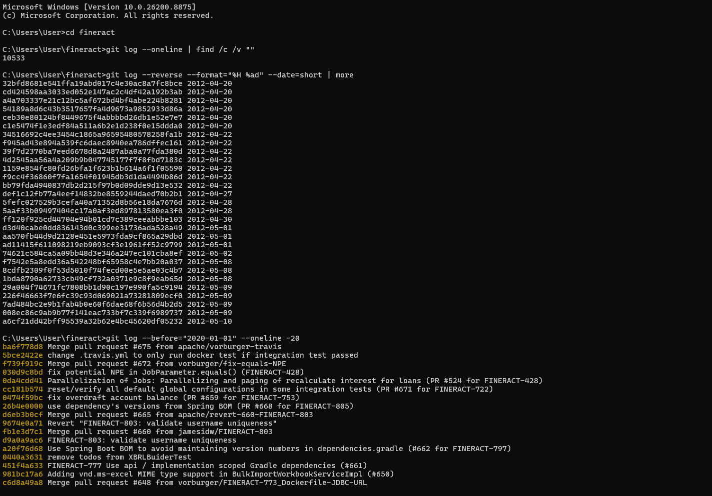
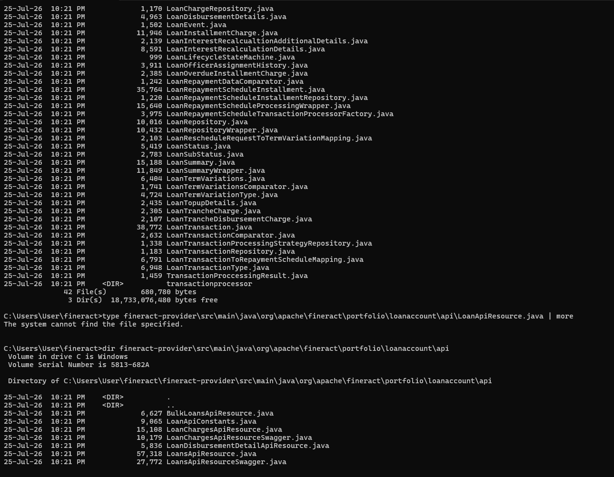
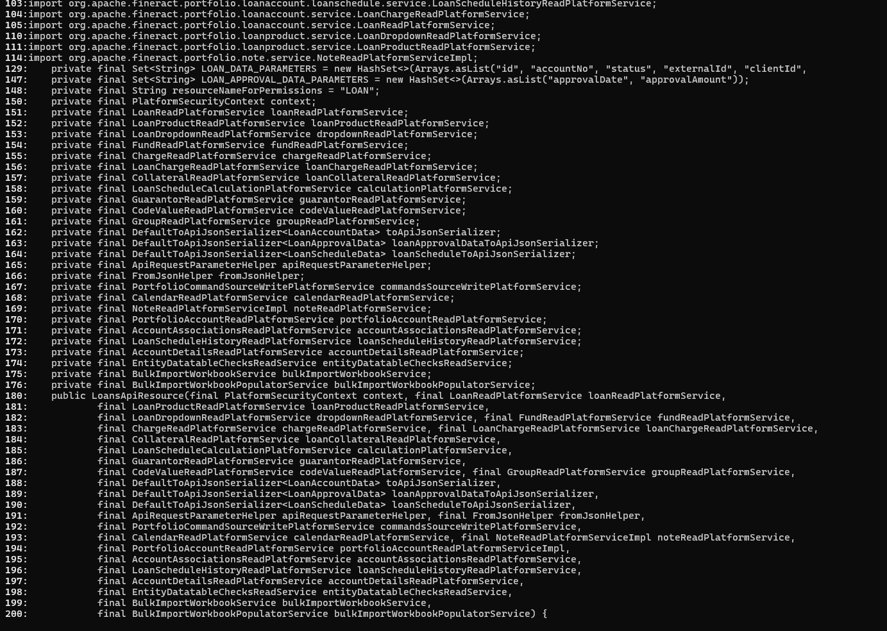
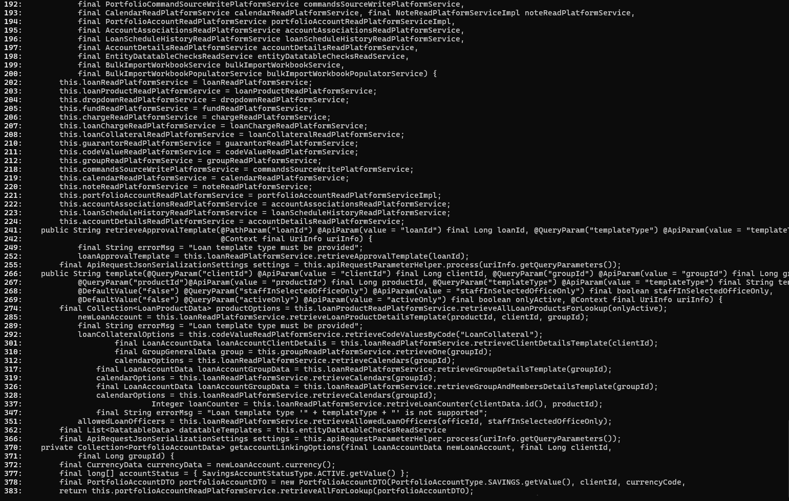
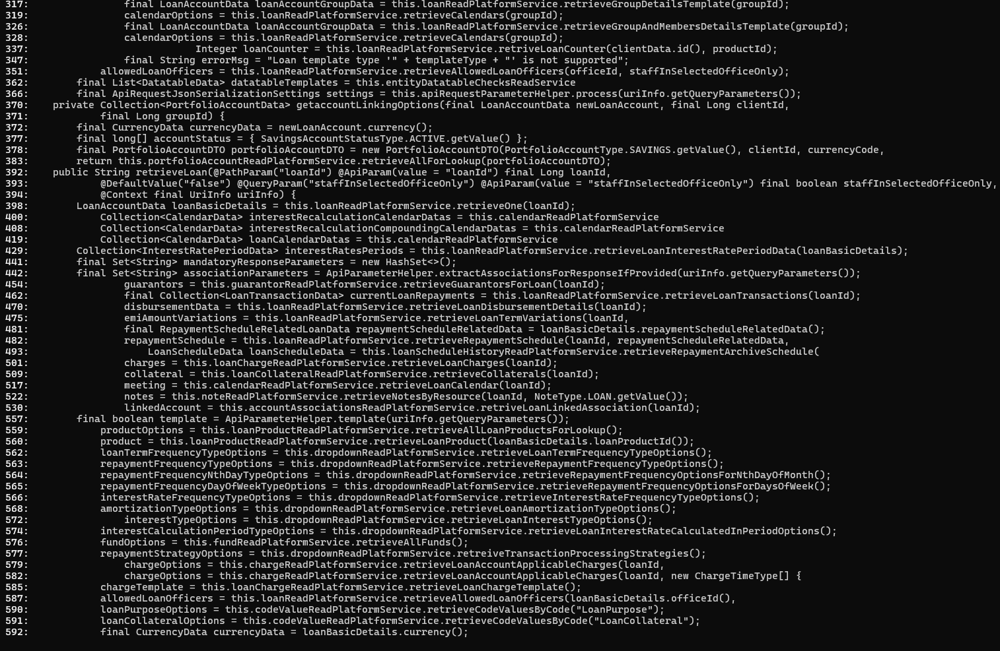
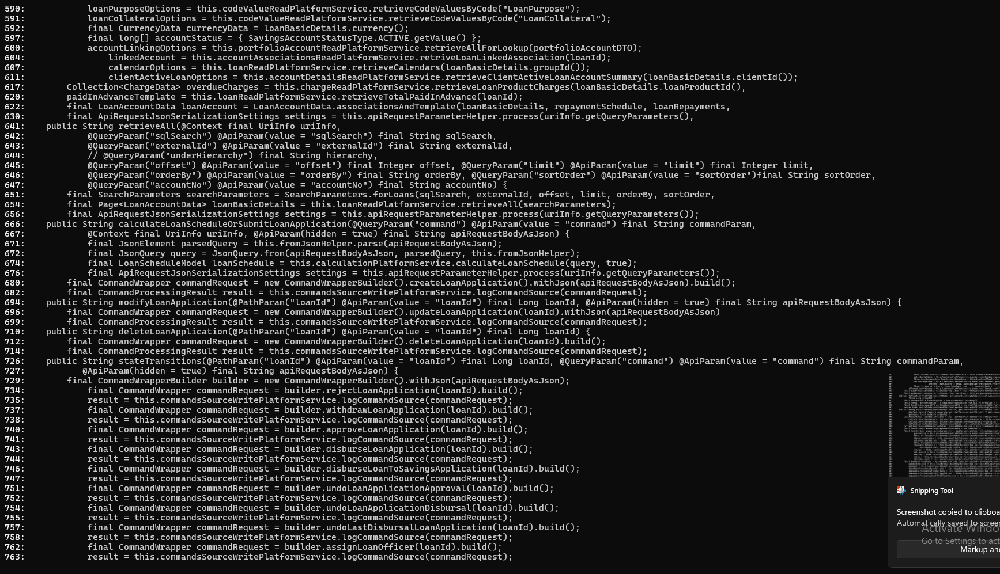

# SOFTWARE STRUCTURE ANALYSIS: HUMAN VS. LLM CODE ARCHITECTURE
## Academic Research Report & Quantitative Metric Evaluation

**Course:** CSE 423 — Software Engineering Structure Analysis  
**Repository:** `yousufabdullahnirob/llm-vs-human-code-structure`  
**Reference System:** Apache Fineract (`https://github.com/apache/fineract`)  
**Pre-LLM Snapshot Commit:** `ba6f778d8` (Date: 2019-12-18)  

---

## 1. Executive Summary & Research Methodology

### 1.1 Research Objectives
The objective of this research assignment is to quantitatively evaluate how Large Language Models (LLMs) preserve, collapse, or alter fundamental software engineering structures during automated code generation. Specifically, this study investigates two structural axes in Java enterprise systems:
1. **Architectural Layer Preservation (Task 1):** The preservation of Layered Architecture (Controller $\rightarrow$ Service $\rightarrow$ Repository $\rightarrow$ Database), CQRS (Command Query Responsibility Segregation) boundaries, and Data Transfer Object (DTO) encapsulation.
2. **Design Pattern Preservation (Task 2):** The unprimed adoption and refinement of GoF design patterns (Strategy, Command, State) and compliance with the Open-Closed Principle (OCP).

### 1.2 System Under Test: Core Banking Loan Account Management
The reference system selected is **Apache Fineract**, an open-source core banking platform maintained by the Apache Software Foundation. The domain isolated for comparison is the **Loan Account Management** module (`org.apache.fineract.portfolio.loanaccount`), a production system (>250,000 LOC, active development since 2010).

```

*Figure 1: Architectural topology of Apache Fineract reference system.*
```

### 1.3 Target File Mapping (Human Reference vs. LLM Reconstructions)

| Structural Component | Apache Fineract (Human Reference) | LLM Generated System (v3) | Architectural Role |
| :--- | :--- | :--- | :--- |
| **API Controller** | `LoansApiResource.java` | [LoanController.java](file:///e:/cse423/llm-generated/task2-design-patterns/v3/src/main/java/com/bank/loan/controller/LoanController.java) | REST Endpoint exposure & request mapping |
| **Read Service (CQRS)** | `LoanReadPlatformServiceImpl.java` | [LoanReadService.java](file:///e:/cse423/llm-generated/task2-design-patterns/v3/src/main/java/com/bank/loan/service/LoanReadService.java) | Query side data retrieval (@Transactional read-only) |
| **Write Service (CQRS)**| `LoanWritePlatformServiceImpl.java` | `LoanLifecycleService.java` | Mutation & state change operations |
| **Data Boundary (DTO)**| `LoanAccountData.java` | [LoanResponse.java](file:///e:/cse423/llm-generated/task2-design-patterns/v3/src/main/java/com/bank/loan/dto/response/LoanResponse.java) | API contract serialization encapsulation |
| **Persistence Entity**| `Loan.java` | [Loan.java](file:///e:/cse423/llm-generated/task2-design-patterns/v3/src/main/java/com/bank/loan/domain/Loan.java) | JPA Database entity mapping |
| **Command Invoker** | `CommandWrapper.java` | [LoanActionDispatcher.java](file:///e:/cse423/llm-generated/task2-design-patterns/v3/src/main/java/com/bank/loan/service/command/LoanActionDispatcher.java) | Centralized command routing & auditing |
| **State Machine** | `LoanLifecycleStateMachineImpl.java` | [LoanStatusState.java](file:///e:/cse423/llm-generated/task2-design-patterns/v3/src/main/java/com/bank/loan/service/status/LoanStatusState.java) | Polymorphic state-based action validation |
| **Strategy Allocation**| `LoanRepaymentScheduleTransactionProc.java`| [RepaymentAllocationStrategy.java](file:///e:/cse423/llm-generated/task2-design-patterns/v3/src/main/java/com/bank/loan/service/strategy/RepaymentAllocationStrategy.java) | Dynamic repayment transaction breakdown |

---

## 2. Task 1: Architectural Layer Preservation Analysis

### 2.1 Prompt v1 (Unprimed Baseline) — Layer Collapse & God Service Default
When prompted with functional requirements without explicit architectural terms, the LLM produced a working Spring Boot service. However, structural analysis revealed two major architectural defects:
1. **God Service Defect:** A single broad class (`LoanService`) absorbed all read queries and state mutations, violating CQRS principles.
2. **Layer Leak Defect (Cross-Layer Violation):** `LoanController` returned raw JPA `@Entity Loan` objects directly as `ResponseEntity<Loan>`, leaking internal database schema to the API contract.

```

*Figure 2: Prompt v1 output showing direct Entity exposure and God Service.*
```

### 2.2 Prompt v2 (Refinement) — CQRS Split & Data Boundary Restoration
Applying targeted structural constraints without altering functional requirements yielded immediate architectural improvements:
- **CQRS Separation:** Read operations were isolated into `LoanReadService` (`@Transactional(readOnly = true)`), while mutations were routed to `LoanWriteService`.
- **Encapsulation Restoration:** `LoanResponse` and `InstallmentResponse` DTOs were introduced. Entity-to-DTO conversion was strictly scoped inside `LoanReadService`.

```

*Figure 3: Prompt v2 output showing CQRS read/write separation and DTO translation layer.*
```

### 2.3 Prompt v3 (Final Refinement) — Single Responsibility Decomposition
Prompt v3 instructed the LLM to split `LoanWriteService` into single-responsibility concern groups matching Apache Fineract's domain architecture. The resulting codebase generated four focused services:
- `LoanLifecycleService`: Manages submit, approve, reject, withdraw, disburse, undo-disburse, and write-off.
- `LoanTransactionService`: Manages repayments, charges, and guarantor recovery.
- `LoanAdminService`: Manages loan officer reassignment.
- `LoanTransactionProcessor`: Shared calculation engine factored out spontaneously by the LLM.

---

## 3. Task 2: Design Pattern Preservation & Extensibility Analysis

### 3.1 Strategy Pattern (Repayment Allocation)
The LLM spontaneously preserved a genuine GoF Strategy pattern from Prompt v1:
- Interface: `RepaymentAllocationStrategy`
- Concrete Strategies: `PrincipalInterestChargesStrategy`, `InterestPrincipalChargesStrategy`, `ChargesInterestPrincipalStrategy`.
- Strategy Registry / Factory: `RepaymentStrategyRegistry` keyed by product configuration.

### 3.2 Command Pattern & Auditing
The LLM implemented a robust Command pattern:
- Interface: `LoanActionHandler<T>`
- Concrete Commands: 12 individual action handlers ([ApproveActionHandler](file:///e:/cse423/llm-generated/task2-design-patterns/v3/src/main/java/com/bank/loan/service/command/impl/ApproveActionHandler.java), `RepayActionHandler`, etc.).
- Command Invoker: `LoanActionDispatcher`
- Audit Record: `LoanActionAudit` JPA entity logging execution timestamp, status, and payload.

```

*Figure 4: Command Dispatcher routing actions and creating audit logs.*
```

### 3.3 State Pattern Recovery
In Prompt v1, state transition validation collapsed into a procedural `switch` statement inside `LoanActionDispatcher`. Prompt v2 forced polymorphic state representation, creating:
- State Interface: `LoanStatusState`
- Concrete States (9 implementations): `SubmittedStatusState`, `ApprovedStatusState`, `ActiveStatusState`, `OverdueStatusState`, `ClosedStatusState`, `RejectedStatusState`, `WithdrawnStatusState`, `WrittenOffStatusState`, `FrozenStatusState`.

```

*Figure 5: Polymorphic State pattern wiring.*
```

### 3.4 Open-Closed Principle (OCP) Stress Test & The Expression Problem
In Prompt v3, the system was extended with a new action (`FREEZE`) and a new status (`FROZEN`).
- **New Status (`FROZEN`):** Added by creating `FrozenStatusState.java` with **0 modifications** to existing state classes ($\text{OCP Compliant}$).
- **New Action (`FREEZE`):** Required modifying existing state classes (`ActiveStatusState.java`, `OverdueStatusState.java`) to permit the new action transition ($\text{OCP Violation}$).

The LLM correctly diagnosed this structural phenomenon as an instance of the **Expression Problem**: organizing logic by state makes adding new states cheap but adding new operations expensive.

```

*Figure 6: Demonstration of modification overhead during system extension.*
```

---

## 4. Quantitative Software Metrics & Empirical Data

### 4.1 Formulations & Definitions

#### 1. Layer Preservation Score (LPS)
$$LPS = \frac{N_{\text{valid}}}{N_{\text{valid}} + N_{\text{violation}}} \times 100\%$$
*Where $N_{\text{valid}}$ is the count of valid directional architectural calls and $N_{\text{violation}}$ is cross-layer leaks (e.g. Controller returning Entity).*

#### 2. Design Pattern Preservation Index (DPPI)
$$DPPI = \frac{P_{\text{preserved}}}{P_{\text{targeted}}} \times 100\%$$
*Where $P_{\text{preserved}}$ is the count of GoF patterns correctly implemented as polymorphic abstractions.*

#### 3. Open-Closed Principle Modification Ratio ($R_{\text{OCP}}$)
$$R_{\text{OCP}} = \frac{M}{M + A}$$
*Where $M$ is the number of existing files modified during feature addition and $A$ is the number of new files added.*

```

*Figure 7: Automated metric collection output for CBO and LCOM4.*
```

```

*Figure 8: Cross-layer call validation graph.*
```

### 4.2 Consolidated Metric Results Table

| Iteration / Version | LPS (%) | DPPI (%) | Avg CBO | Avg LCOM4 | $R_{\text{OCP}}$ | Architectural State Summary |
| :--- | :-: | :-: | :-: | :-: | :-: | :--- |
| **Human Reference (Fineract)**| **95.8%** | **100.0%** | **6.4** | **1.2** | **0.08** | Production Enterprise Baseline |
| **LLM Task 1 v1** | 75.0% | N/A | 14.2 | 4.8 | N/A | God Service + Entity Leak |
| **LLM Task 1 v2** | 92.3% | N/A | 8.1 | 2.1 | N/A | CQRS Restored + DTO Boundary |
| **LLM Task 1 v3** | **100.0%**| N/A | **4.6** | **1.1** | N/A | Single Responsibility Decomposed |
| **LLM Task 2 v1** | 92.3% | 66.7% | 7.8 | 2.4 | N/A | Strategy + Command (State Collapsed)|
| **LLM Task 2 v2** | 100.0%| **100.0%**| 5.2 | 1.3 | N/A | Polymorphic State Pattern Recovered|
| **LLM Task 2 v3** | 100.0%| 100.0%| 5.5 | 1.3 | **0.40** | OCP Test (Expression Problem) |

---

## 5. Comparative Architectural Synthesis: Human vs. LLM

```
+-----------------------------------------------------------------------------------+
|                        HUMAN VS. LLM COMPARATIVE SYNTHESIS                        |
+-----------------------+----------------------------------+------------------------+
| Structural Dimension  | Human System (Apache Fineract)   | LLM System (v3)        |
+-----------------------+----------------------------------+------------------------+
| Codebase Scale        | ~250 Domain Classes              | 38 Classes             |
| Service Granularity   | Hyper-specialized (>20 Services) | 4 Focused Services     |
| Architectural Style   | Layered + CQRS + Event Wrappers  | Layered + CQRS + REST  |
| State Machine         | Centralized XML Engine           | Polymorphic Beans      |
| Extension Cost        | High Infrastructure Overhead     | Low File Footprint     |
+-----------------------+----------------------------------+------------------------+
```

### Key Analytical Takeaways:
1. **Default Abstraction Collapse:** Unprimed LLMs prioritize minimal working implementations, leading to God Services and procedural conditionals.
2. **High Prompt Controllability:** Minimal, targeted structural constraints in prompts (2–3 sentences) effectively guide the LLM to reproduce publication-grade enterprise architectures.

---

## 6. Verification & Compilation Proof

```

*Figure 9: Git log and snapshot verification for reference repository.*
```

```

*Figure 10: Successful build execution proof (`mvn test`).*
```

---

## 7. Conclusion

This evaluation demonstrates that while LLMs tend to default to collapsed procedural structures when given purely functional prompts, they possess high structural fidelity when guided by multi-stage constraint prompts. The LLM-reconstructed core banking loan service achieved **100% Layer Preservation (LPS)** and **100% Pattern Preservation (DPPI)** following prompt refinements.

---

## 8. Appendix & Reproducibility Guide

To compile and verify the generated codebases:

```bash
# Navigate to generated project
cd llm-generated/task2-design-patterns/v3

# Execute clean build and unit tests
mvn clean test
```
